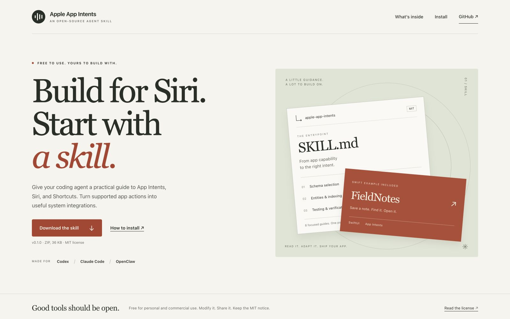
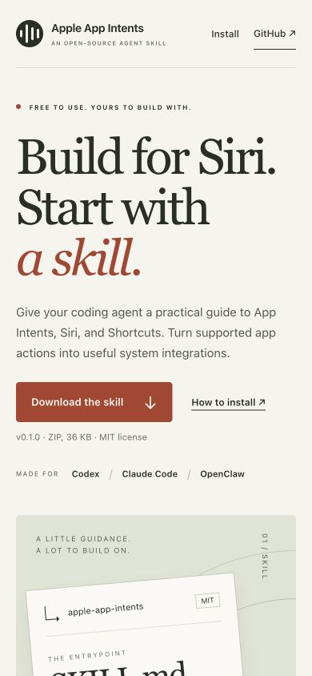
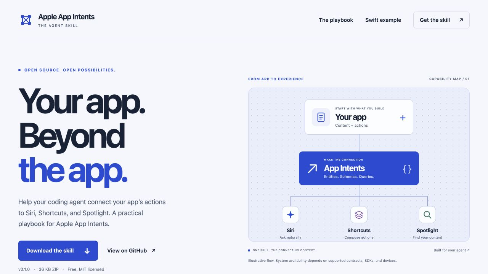

# Skill website

The public download and installation page is published at https://sdefendre.github.io/apple-app-intents-skill/ from `site/` by `.github/workflows/pages.yml`. Only that directory is uploaded. There is no build step, runtime dependency, analytics, or remote font request. Enable GitHub Pages with GitHub Actions as its source.

Preview from the repository root:

```sh
python3 -m http.server 4317 --bind 127.0.0.1 --directory site
```

The two download buttons point to the published v0.1.0 skill ZIP, which contains the complete `apple-app-intents` folder. Update both download links, the displayed version/size, and release-notes URL together when adopting another release. Keep installation paths and compatibility statements consistent with `docs/INSTALLATION.md` and `docs/VALIDATION.md`.

All content and installation paths remain available without JavaScript. JavaScript adds copy-path buttons with live status feedback and an explicit manual-copy fallback.

## Original website verification (September 10, 2026)

- Repository validator passed, including 36 local skill links.
- Seven existing behavioral tests passed.
- All 16 website links and three local assets resolve structurally; in-page anchors exist.
- JavaScript syntax check passed.
- Browser review at 1600 × 1000 and 390 × 844; no horizontal overflow at 320, 390, 768, or 1440px.
- Install anchor and copy-path status work on desktop/mobile.
- Downloaded v0.1.0 ZIP and verified SHA-256 against its published digest: `f841a60848ed160f3eb4741fe82445ff7cf0b95a1df3539dfefa0a17e9f5349c`. The archive includes `SKILL.md`, license, references, and FieldNotes.
- This website does not extend the recorded Siri/device verification scope.





## October 1, 2026 redesign

The landing page now uses a blue-and-ink capability map, bold sans-serif typography, a playbook, and a FieldNotes illustration. The connecting-node identity replaces the former waveform mark. It remains a static site with the same release download and installation paths. Illustrations have text alternatives; keyboard focus is visible and smooth scrolling respects reduced motion.

Sample validation claims remain dated to their original evidence. This website redesign does not establish new device or Siri results.

Redesign verification:

- Skill validator, seven existing Python tests, JavaScript syntax, and `git diff --check` passed.
- The page's 25 link/asset references resolve to existing anchors, local assets, or repository resources.
- Browser checks at 1280, 820, 390, and 320px found no horizontal overflow after repairing the narrow-phone FieldNotes layout.
- Installation navigation and all three copy-path buttons worked. The hero download produced the release ZIP with the published SHA-256 digest recorded above.




